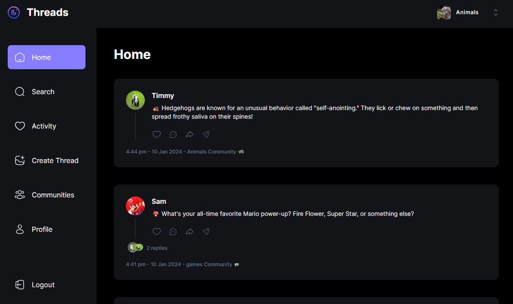

## Threads Clone
_A project created through Javascript Mastery's [video tutorial](https://www.youtube.com/watch?v=O5cmLDVTgAs) for an introduction to MongoDB and Clerk_

### Features
1. User authentication with Google, GitHub and email via [Clerk](https://www.clerk.com)
2. Search users
3. Track activity (e.g. Other's comments on your threads)
4. Create thread
5. Communities (implemented using Clerk organisations)
6. View profile information

### Disclaimers
I created this web application by going through the [tutorial](https://www.youtube.com/watch?v=O5cmLDVTgAs) hosted by Javascript Mastery. It is meant to be an educational project to expose me the areas of web development that I did not have before. Namely:
- Usage of NoSQL such as MongoDB and integrating it with Next.JS
- Introduction of [Clerk](https://www.clerk.com) and how to set it up for seamless and secure user authentication
- Exposure to pre-built web UI components such as [shadcn](https://ui.shadcn.com/)

I would highly recommend this tutorial as it not only provides a good introduction to the above tech stack, but Javascript Mastery also delves into the details of NextJS such as how server-side rendering works and how we can utilise actions to directly connect to the database on the server-side. 👍